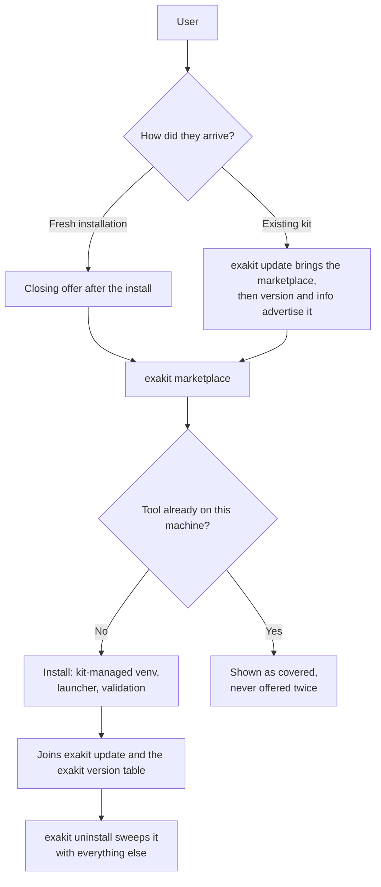
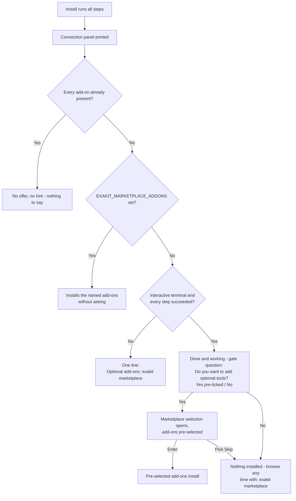
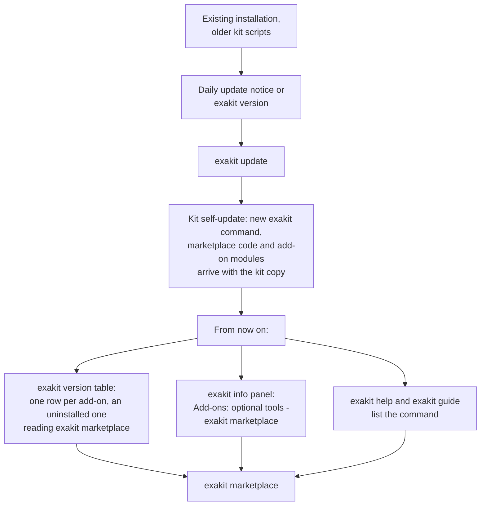
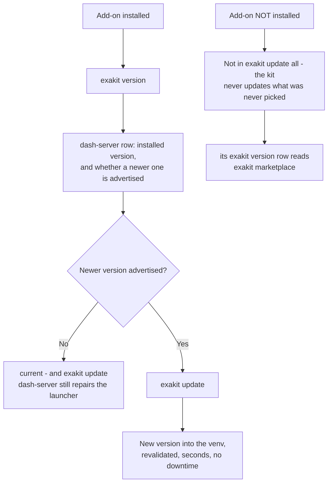
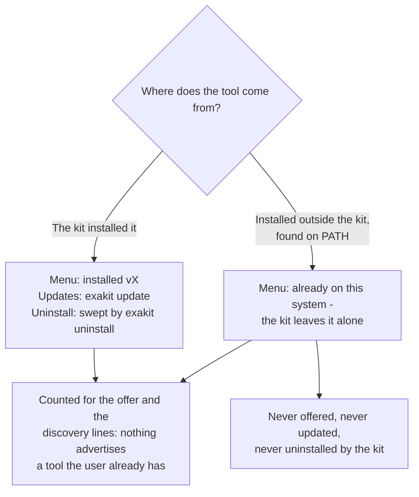
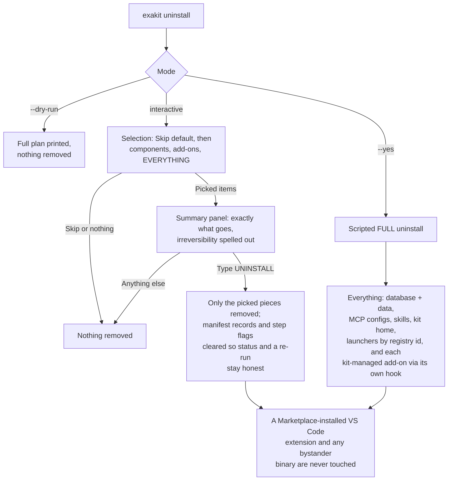

# The marketplace: optional add-ons, and how to add one

> **0.3.0:** the kit is one Python implementation. An add-on is described
> once in `catalog/addons/<id>/addon.json` (schema in
> [docs/design.md](docs/design.md), section 3.2) and installed by a generic
> lifecycle; the steps only one add-on needs are a short Python class under
> `exakit/addons/`. The walkthrough at the end of this document is that
> recipe.

The marketplace is the kit's home for **optional tools** — things worth having
next to the database but not worth lengthening the install for. dash-server
(the AI dashboard host) is the first one.

This document is three things: the contract for how the marketplace behaves,
how a user meets it in every scenario — fresh installation, existing kit,
browsing, updating, removal — each with a flowchart, and the **complete
walkthrough for adding a new add-on**, which is deliberately three additive
changes with no case-statement surgery anywhere.

Contents:
[How it behaves](#how-it-behaves-the-contract) ·
[At a glance](#at-a-glance) ·
[1. Fresh installation](#scenario-1-fresh-installation) ·
[2. Existing kit, via the update path](#scenario-2-existing-kit-via-the-update-path) ·
[3. Browsing and installing](#scenario-3-browsing-and-installing) ·
[4. Keeping an add-on up to date](#scenario-4-keeping-an-add-on-up-to-date) ·
[5. The tool is already on the machine](#scenario-5-the-tool-is-already-on-the-machine) ·
[6. Removal](#scenario-6-removal) ·
[Where the marketplace appears](#where-the-marketplace-appears) ·
[Quick reference](#quick-reference) ·
[Where the pieces live](#where-the-pieces-live) ·
[Adding a new add-on](#adding-a-new-add-on-the-walkthrough) ·
[Verifying](#verifying)

---

## How it behaves (the contract)

- **Never in the install flow.** The setup scripts install nothing from the
  marketplace. After a successful interactive install, the closing screen
  says *"Your Starter Kit installation is done and working"* and asks one
  gate question as a cursor selection — *Do you want to add optional tools?*
  with Yes pre-ticked and No as the opt-out. Yes opens the marketplace
  selection, where the available add-ons come pre-selected (exactly like the
  data-load menu pre-selects pending datasets), so Enter installs them and
  the Skip row still backs out; No prints the one command to come back with. No
  typing anywhere.
- **`exakit marketplace`** is the command: every add-on with a one-line
  description, Space selects, Enter installs. Non-interactive runs (agents,
  CI) answer with `EXAKIT_MARKETPLACE_ADDONS=<ids csv | all | none>` instead —
  this also pre-answers the closing offer.
- **Dynamic by applicability.** An add-on that extends something the user does
  not have is not offered at all — no row, no table line, no mention anywhere.
  The VS Code extension is only listed on a machine that has VS Code; naming
  it anyway (`EXAKIT_MARKETPLACE_ADDONS=exasol-vscode`) explains that the host
  app is missing instead of failing deep in the installer. A copy the kit
  already installed stays visible even if the host app disappears later, so it
  can still be updated or removed.
- **Dynamic by presence.** An add-on already on the machine is never
  advertised — whether the kit installed it (shown as *installed (vX)*) or it
  was already on the system outside the kit (shown as *already on this system —
  the kit leaves it alone*; the kit never updates or uninstalls what it did
  not install). When everything is present, the offer and the discovery lines
  disappear entirely.
- **Installed add-ons are full components.** They join `exakit update`,
  report in `exakit version`, pin with
  `EXAKIT_<ID>_VERSION`, and are swept by `exakit uninstall`. Add-ons you never
  picked are never touched by `update all`.

---

## At a glance

One add-on, from first contact to removal:



---

## Scenario 1: Fresh installation

The installation itself is unchanged: database, exapump, MCP server, pyexasol,
the exakit command. The marketplace appears once, at the very end, and only
when there is something to offer.



What the user sees on an interactive run — a selection, never typing:

```
[ok] Your Starter Kit installation is done and working.
 -   The marketplace has more useful tools for it.
 -   Do you want to add optional tools?
    > [x] Yes - show the marketplace
      [ ] No - maybe later
```

Answering yes opens exactly the screen
[Scenario 3](#scenario-3-browsing-and-installing) shows — the same table, the
same pre-ticked rows, the same `Skip`.

Details that matter:

- A run with soft failures (a step that did not finish) gets the one-line
  hint, not the "done and working" message.
- A scripted or agent-driven install is never blocked by a question:
  `EXAKIT_MARKETPLACE_ADDONS=dash-server` (or `all` / `none`) answers it, and
  with nothing set the offer degrades to the hint line.
- Nothing in the offer can fail the install that just succeeded; it runs
  best-effort on every platform.

## Scenario 2: Existing kit, via the update path

A user who installed the kit before the marketplace existed reaches it
through the normal update mechanism. No reinstall.



Discovery is dynamic: `exakit version` gives a row only to an add-on this
machine could actually install, and an installed one reads as an ordinary
component instead. An updated kit whose user already has every tool never
mentions the marketplace at all.

The dim `Optional add-ons are available (dash-server) ...` footer under the
table is gone. It repeated, once per screen, the command the rows already
carry.

## Scenario 3: Browsing and installing

`exakit marketplace` is one screen in the kit's established look: a single
tree-checkbox table, the same component the data-load menu uses, carrying the
add-on, its version and its one-line description. The available add-ons come
pre-selected (exactly like the data-load menu pre-selects pending datasets),
so Enter installs them; Space toggles, and the `Skip` row is the explicit
opt-out. With no terminal nothing is installed at all — the run says so and
names `exakit marketplace --list`, `exakit marketplace <id>` and
`EXAKIT_MARKETPLACE_ADDONS`.

```
  ╭─ Marketplace add-ons ────────────────────────────────────────────────────╮
  │     Add-on               Version  Description                            │
  │ [✓] Select All                                                           │
  │ [✓] ├─ dash-server       0.1.0    Agent-operated Dash hosting for live   │
  │     │                             analytical apps                        │
  │ [✓] ├─ exasol-scheduler  0.2      Lightweight table-driven SQL job       │
  │     │                             scheduling for Exasol                  │
  │ [✓] ├─ exasol-vscode     1.7.0    A Visual Studio Code extension for     │
  │     │                             working with Exasol databases.         │
  │ [✓] └─ json-tables       0.3      Exasol JSON Tables: ingest, query, and │
  │                                   reshape JSON-shaped data in Exasol.    │
  │ [ ] Skip                                                                 │
  ╰──────────────────────────────────────────────────────────────────────────╯
```

An add-on this machine cannot install — no VS Code-compatible editor, no
prebuilt binary for the architecture, already installed outside the kit — gets
a dimmed, unpickable row carrying the reason instead, or no row at all when it
is neither applicable nor present. The descriptions are each repository's
GitHub About, fetched and cached; offline the kit falls back to the tagline in
`setup/help/<id>.json`, so the wording of a row can differ from the capture
above. The same rows fill in with progress as each pick installs — the
selection and the install are one table, not two screens.

```mermaid
flowchart TD
    A[exakit marketplace] --> B{Installation present?}
    B -->|No| C[No installation found.<br>Run the installer first.]
    B -->|Yes| D[Build one row per add-on]
    D --> E{Row state}
    E -->|Not present| F[Selectable, with its<br>one-line description]
    E -->|Kit-installed| G[Dimmed: installed v0.1.0 -<br>update with: exakit update]
    E -->|On the system,<br>outside the kit| H[Dimmed: already on this system -<br>the kit leaves it alone]
    E -->|Module missing<br>from this kit copy| I[Dimmed: not part of this kit copy -<br>run: exakit update]
    F --> J{User confirms a selection?}
    J -->|Skip or nothing| K[Marketplace closed -<br>nothing was installed]
    J -->|Yes| L[Install each picked add-on:<br>venv under the kit home,<br>launcher, live validation]
    L --> M{Install succeeded?}
    M -->|Yes| N[Installed - it now updates with:<br>exakit update]
    M -->|No| O[Warn with the reason and the retry<br>command; other picks still proceed]

    click N "#scenario-4-keeping-an-add-on-up-to-date"
```



For dash-server specifically, "install" means: a Python venv at
`~/.exasol-starter-kit/dash-server-venv` (created with pip seeded, and
self-repaired if a pre-existing venv lacks pip), a launcher at
`~/.local/bin/dash-server` that bootstraps the kit's database connection at
run time (the password itself is never written into any file), and a live
check that the MCP control plane answers on `http://127.0.0.1:5100/mcp`
before the add-on is reported ready.

**That control plane is loopback-only and unauthenticated.** Anything that can
reach `127.0.0.1` on the machine can call its tools, which build, deploy and
pip-install dependencies for Dash apps as the installing user. Fine on a
personal laptop; on a shared or multi-user machine, stop dash-server when it is
not in use (`exakit stop`), and never expose the port on a LAN or through a
tunnel. dash-server is also the one add-on installed **without a kit-pinned
checksum** — the version is tag-pinned, but a GitHub source tarball publishes no
digest to verify the download against, and its Python dependencies come from
PyPI unpinned. Every other add-on refuses an artifact whose digest it cannot
check.

Non-interactive use, same contract as the closing offer:

```bash
EXAKIT_MARKETPLACE_ADDONS=dash-server exakit marketplace   # ids csv, all, or none
```

## Scenario 4: Keeping an add-on up to date

Once installed, an add-on is a normal component. Nothing new to learn.



- `exakit update` (all) covers installed add-ons automatically and never
  touches uninstalled ones.
- `exakit version` lists the add-on with the live version from the venv.
- The advertised version comes from `versions.json` like every component;
  maintainers bump it with a one-file pull request and CI verifies the
  release tag exists before it lands.

## Scenario 5: The tool is already on the machine

The dynamic rule, in both directions:



Detection is honest in both directions: a stale manifest record without a
real install does not count as installed (the live probe is the authority),
and the kit's own launcher on PATH is not mistaken for a system install.

## Scenario 6: Removal

`exakit uninstall` is a selection too: Skip is the pre-selected safe default,
then the components actually on the machine, then the kit-managed add-ons —
each removable on its own — then EVERYTHING. What was picked is shown back in
a summary panel before the typed UNINSTALL gate.



## Where the marketplace appears

| Surface | When | What it says |
|---|---|---|
| End of a successful interactive install | Something still on offer | The one-time offer: done and working, add tools now? |
| End of any other install | Something still on offer | One hint line naming the command |
| `exakit version` table | Something still on offer | A row per add-on, an uninstalled one reading `exakit marketplace` in its Status cell |
| `exakit info` panel | Something still on offer | `Add-ons: optional tools (dashboards & more): exakit marketplace` |
| `exakit guide`, `exakit help`, `exakit catalog` | Always | The command with a one-line description |
| Anywhere above | Everything already present | Nothing - every mention disappears |

## Quick reference

| Situation | Command or event | Outcome |
|---|---|---|
| Fresh install, interactive, all green | closing offer | gate question (Yes pre-ticked / No), then the selection menu with add-ons pre-selected; Enter installs, Skip or No skips |
| Fresh install, scripted | `EXAKIT_MARKETPLACE_ADDONS=...` | Installs the named add-ons, no questions |
| Kit from before the marketplace | `exakit update` | Kit self-update delivers the command; discovery lines take over |
| Browse | `exakit marketplace` | One row per add-on with live state; Space and Enter |
| Install failed | menu output | Reason plus retry command; nothing else breaks |
| Update one add-on | `exakit update` | Advertised version installed and revalidated |
| Update everything | `exakit update` | Installed add-ons included, others never touched |
| Tool already on the system | any surface | Respected and skipped; the kit does not manage it |
| Remove one add-on | `exakit uninstall` | Pick it from the selection; its own hook removes it, summary + typed gate first |
| Remove the kit | `exakit uninstall` (EVERYTHING row, or `--yes`) | Full teardown, kit-managed add-ons included via their hooks; Marketplace-installed copies untouched |

Every behavior in the scenarios above is enforced by the automated suites
(`tests/unit/app/test_marketplace.py`, `tests/unit/lifecycles/test_addons.py`,
`tests/unit/app/test_uninstall_repair.py`) and the frozen `--json` shapes in
`tests/contract/test_cli.py`.

---

The rest of this document is for whoever adds an add-on.

## Where the pieces live

| Piece | Where |
|---|---|
| The add-on's description: id, kind, source, platforms, launcher, skill, help, fallback version | `catalog/addons/<id>/addon.json` |
| The generic lifecycles (a Python venv, a prebuilt binary, a host-application extension) | `exakit/lifecycles/{python_venv,binary,host_extension}.py` over `exakit/lifecycles/base.py` |
| The steps only one add-on needs (a port, a database user, a launcher with environment, a service) | `exakit/addons/<id_>.py`, a `Lifecycle` subclass of the generic kind, picked by `exakit.lifecycles.for_addon` |
| The marketplace command: list, scripted and menu answers, the install loop, `uninstall <id>` | `exakit/app/marketplace.py` |
| Services (status, start, stop, autostart) for add-ons that run | `exakit/app/services.py` over `exakit/adapters/process/services.py` |
| The advertised version and the digests | `versions.json`, `components.<id>` |
| The help document (also the marketplace description) | `help/<id>.json` |
| The add-on's AI skill | `skills/<id>/SKILL.md` with an `addon:` key |

Every generic question - is it installed, is it on the system already, can it
run here, what version is advertised, what does `exakit update <id>` do, what
does `exakit uninstall <id>` remove - is answered by the lifecycle, so a new
add-on needs no edits to the marketplace, `status`, `version` or `update`.
The conventions, for an id like `my-tool`:

| Convention | Value for `my-tool` |
|---|---|
| Module (dashes to underscores) | `exakit/addons/my_tool.py`, class `Lifecycle` |
| Version env override | `EXAKIT_MY_TOOL_VERSION`; the unverified-download hatch is `EXAKIT_ALLOW_UNVERIFIED_MY_TOOL=1` |
| versions.json block | `components.my-tool` (`repo` for a GitHub release, `package` for PyPI, `sha256` keyed by platform, `wheel`, or `vsix`) |
| Manifest keys | `components.my_tool.*`, `desired.my-tool` |
| Kit-managed state | venv or engine under `$EXAKIT_HOME`, launcher at `$EXAKIT_BIN_DIR/my-tool` (swept by the full uninstall by catalog id) |

---

## Adding a new add-on: the walkthrough

Three files and, only when the generic lifecycle is not enough, one class.
`exakit/addons/dash_server.py` is the reference for a Python tool that runs
as a service, `exasol_scheduler.py` for a prebuilt binary with a database
user, `json_tables.py` for a tool the kit repackages itself, and
exasol-vscode needs no module at all: the generic host-extension lifecycle
covers it from its `addon.json`.

### 1. Describe it: `catalog/addons/my-tool/addon.json`

```json
{
  "schema_version": 1,
  "id": "my-tool",
  "title": "my-tool (what it is, in a few words)",
  "kind": "python-venv",
  "source": {"type": "pypi", "package": "my-tool"},
  "platforms": ["macos-aarch64", "macos-x86_64", "linux-aarch64", "linux-x86_64"],
  "requires": ["personal"],
  "provides": ["what-it-gives"],
  "launcher": "my-tool",
  "skill": "my-tool",
  "help": "my-tool",
  "fallback_version": "1.0.0"
}
```

`kind` picks the generic lifecycle: `python-venv` (`uv venv` +
`uv pip install <package>==<version>`, a launcher in the bin dir),
`binary` (a verified release asset under `$EXAKIT_HOME/<id>/libexec/`) or
`host-extension` (a verified `.vsix` installed through the editor's CLI).
`tests/unit/domain/test_catalog.py` validates every shipped file, so a typo
fails the suite, not a user.

### 2. Advertise it: `versions.json`

Add `components.my-tool` with `version`, `severity` and, for anything
downloaded as a file, its `sha256` per platform key (or `wheel` / `vsix`).
A download without a digest is refused; the digest is what makes the kit's
supply chain checkable.

### 3. Document it: `help/my-tool.json`

Alongside the other documents. `repo` names the GitHub repository whose
About is the marketplace description (fetched first, cached for a day, retried
an hour after a failure such as the 60-per-hour API limit); `tagline` is the
help screen's header line and the description the kit falls back to when
GitHub cannot be reached and nothing is cached; the rest is the help page
(`exakit help my-tool`).

### 4. Only when needed: `exakit/addons/my_tool.py`

```python
"""my-tool: what the generic lifecycle cannot express, and nothing else."""

from exakit.lifecycles.python_venv import PythonVenvLifecycle


class Lifecycle(PythonVenvLifecycle):
    def launcher_content(self) -> str | None:
        dsn, user, pw_file = self.runtime_credentials()
        script = self.uv().bin_of(self.venv, "my-tool")
        return f'#!/bin/sh\nexport MY_TOOL_DSN="{dsn}"\nexec "{script}" "$@"\n'

    def validate(self) -> None:
        if self.ctx.runner.run([str(self.python), "-c", "import my_tool"], timeout=60).ok:
            self.record(validated=True)
        else:
            self.record(validated=False)
```

Override only what differs: `install`, `validate`, `service` (a
`ServiceHooks` with status/start/stop/url/log_path/autostart for a tool that
runs), `summary`, `applicable`, `system_present`, `uninstall`. Everything
else - versions, verified downloads, the manifest block, launchers, the
`update` and `repair` pattern - is inherited from `exakit/lifecycles/base.py`.
Never print a password: launchers read the credential file at run time.

### 5. Optional: ship an AI skill with it

`skills/my-tool/SKILL.md` with the usual `name` + `description` frontmatter
and one extra key naming its owner:

```yaml
---
name: my-tool
addon: my-tool
description: ... Triggers — "...".
---
```

That key is the whole wiring: the marketplace places the skill when the
add-on is installed and removes it when the add-on is removed. Bump
`components.skills.version` in `versions.json` and add a row to
`skills/README.md`.

### The CI guards (same PR, mechanical)

| File | Change |
|---|---|
| `.github/workflows/versions.yml` | Add `"my-tool"` to the `expected = {...}` components set; add an upstream-exists stanza |
| `.github/workflows/versions-bump.yml` | Add a `COUPLED` entry pointing at `catalog/addons/my-tool/addon.json`'s `fallback_version`; for a GitHub-release tool, add a bump stanza |

### What you do NOT touch

The marketplace menu and list, presence detection, `exakit update my-tool`,
`update all` gating (installed only), the `exakit version` and `exakit status`
rows, `EXAKIT_MARKETPLACE_ADDONS` parsing, the full uninstall's sweep of the
launcher and the kit-home state, placing and removing the add-on's skill - all
generic, all driven by the catalog file and the lifecycle.

---

## Verifying

```bash
python3 -m unittest discover -s tests/unit -t .        # catalog validation, lifecycles, the marketplace over fakes
python3 -m unittest discover -s tests/contract -t .    # marketplace --list --json and uninstall <id> shapes and exit codes
```

Add a test to `tests/unit/lifecycles/test_addons.py` for what is unique to
your class (a launcher's content, an asset name, a port rule) over
`tests/unit/app/harness.py`'s `Sandbox` and the fakes in `tests/unit/fakes.py`;
never the network.

Manual smoke, safely sandboxed:

```bash
EXAKIT_HOME=$(mktemp -d) EXAKIT_BIN_DIR=$(mktemp -d) EXAKIT_MARKETPLACE_ADDONS=my-tool python3 -m exakit marketplace
```
